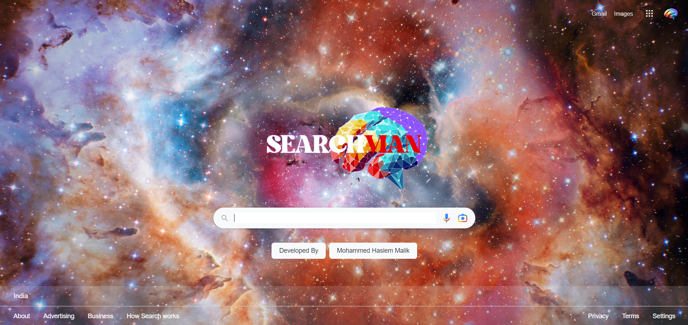
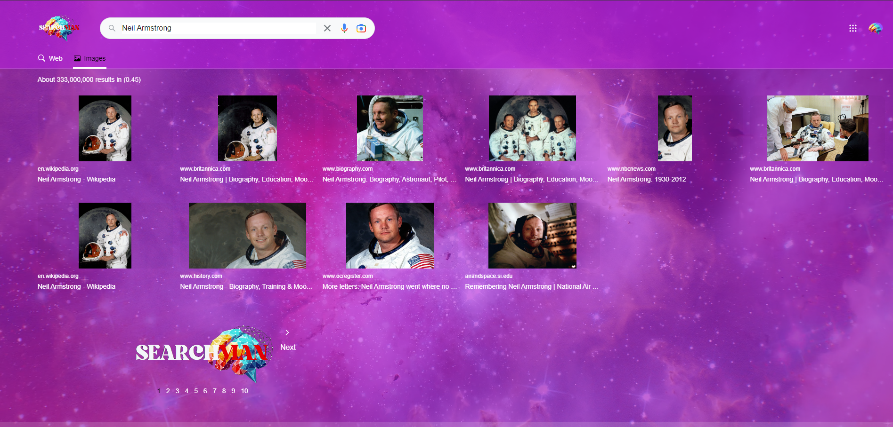
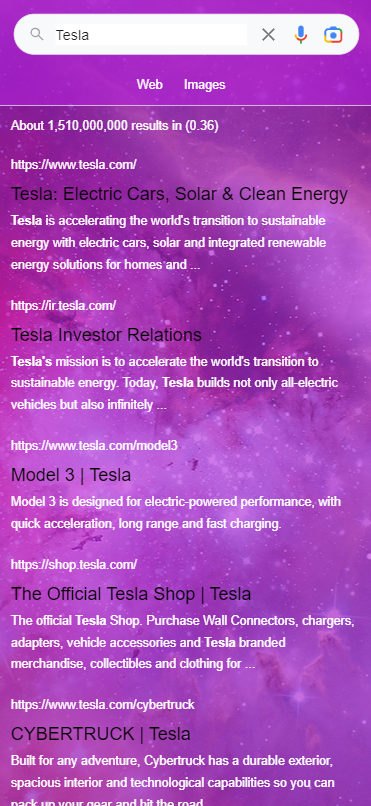
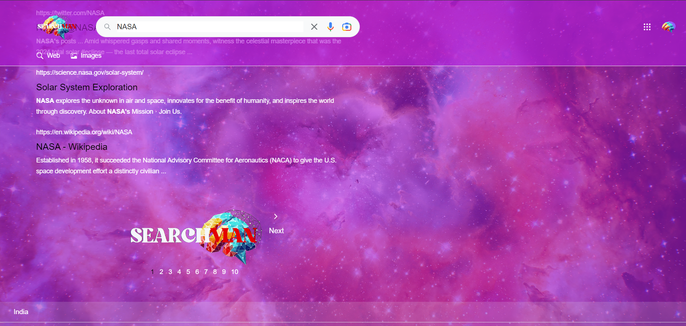

<<<<<<< HEAD
# SearchvianHome
=======

# SearchVian - A Powerful Web Search Engine
## Tech Stack:
RapidAPI
Tailwind CSS
React.js
Node.js

Visite the site here : [Searchvian Website](https://searchvianbymalik.netlify.app/)

 

## Overview
SearchVian is an innovative search engine built to deliver a seamless and efficient user experience when it comes to retrieving web-based information. Powered by the Google Search API, SearchVian is capable of fetching accurate and comprehensive data from the internet, including websites, images, and other web-based resources. The combination of modern technologies like React.js for the frontend, Tailwind CSS for styling, and Node.js for the backend makes SearchVian a reliable and high-performance search engine.

With its simple and intuitive interface, SearchVian enables users to effortlessly enter their queries and receive tailored search results, including images and hyperlinks. Whether you're conducting research, looking for media, or navigating the vast landscape of web content, SearchVian brings the power of a robust search engine to your fingertips.

## Features
1. Rapid and Accurate Search Results
SearchVian leverages the power of the Google Search API through RapidAPI, allowing users to fetch precise and reliable data. The results returned are comprehensive and up-to-date, offering the best resources from across the web.

2. Image Search Capability
Alongside traditional web searches, SearchVian is equipped with an advanced image search feature. Whether you're looking for specific media or conducting a visual search, SearchVian provides relevant image results based on your queries, helping users quickly find what they're looking for.
Image Placeholder:

3. User-Friendly Interface
Designed with Tailwind CSS, SearchVian's interface is clean, modern, and responsive. The design principles ensure that the website is both visually appealing and easy to use on a variety of devices, from desktop computers to mobile phones. The interface is built to minimize clutter and emphasize ease of navigation, making it ideal for users of all experience levels.

4. Speech-to-Text Search
SearchVian takes user interaction to the next level by integrating speech-to-text conversion. Users can simply speak their search queries into the microphone, and the system will automatically convert speech to text and execute the search. This feature is designed for hands-free operation, improving accessibility and convenience. Whether users prefer typing or speaking, SearchVian offers a versatile experience that caters to everyone.
Image Placeholder:

5. Futuristic Design Layout
The overall aesthetic of SearchVian’s layout is forward-thinking, featuring a futuristic design. By adopting a clean, minimalist, and elegant approach, the layout is modern yet functional, giving users a seamless experience. The use of cutting-edge web design principles ensures that users are greeted with a visually stimulating environment that feels both high-tech and user-friendly.

6. Optimized Performance with React.js and Node.js
The frontend of the application is built using React.js, a powerful JavaScript library for building fast and dynamic user interfaces. With React, SearchVian ensures smooth rendering of search results and an interactive user experience. On the backend, Node.js provides a solid infrastructure for handling requests and delivering data swiftly, ensuring that the search engine runs efficiently even with high traffic loads.

7. Secure API Integration
RapidAPI plays a critical role in the secure integration of the Google Search API, ensuring that the data fetched from the web is transmitted and displayed safely. The implementation of robust security practices ensures that user queries and data are processed in a secure environment.

How It Works
SearchVian operates by taking the user's search input and sending it through the Google Search API via RapidAPI. The API returns search results that are parsed and displayed on the front-end in a structured format. Users can either choose to view web-based search results or switch to image search mode to view a gallery of images related to their query.

User submits a search query
Users type their queries into the search bar and press enter. The query is sent to the Google Search API.

Backend processing using Node.js
The query is handled by a Node.js backend, which forwards it to the Google Search API, ensuring fast and secure data transmission.

Displaying results on the frontend with React.js
The React.js frontend receives the data from the backend and dynamically displays the search results in an easy-to-navigate format.

## Future Enhancements
SearchVian is a growing project, and there are several exciting features planned for future updates, including:

Voice Search: Enable users to speak their queries for even faster search experiences.

Search Filters: Advanced filtering options to fine-tune search results (e.g., date, source, relevance).

Dark Mode: An alternative color scheme for better visibility in low-light conditions.

## Conclusion
SearchVian is your gateway to fast, accurate, and user-friendly web searches. By harnessing the power of the Google Search API and combining it with a modern tech stack, SearchVian provides users with a comprehensive and efficient tool for all their search needs. Whether you’re searching for websites, images, or in-depth research material, SearchVian makes sure you get the right information quickly and conveniently.

For more information on contributing, check out the Contributing section in the repository or reach out to me at hasiemmalikm.official@gmail.com.
>>>>>>> IndexMain
